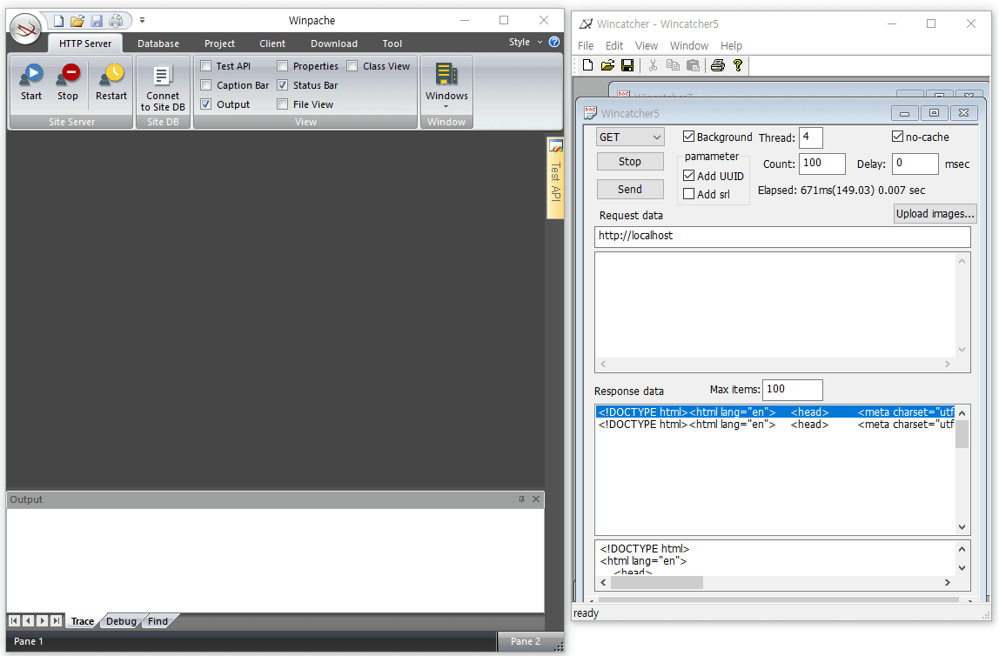

# A high-performance Web Application Server.

Visual C++ MFC development.

## `Winpache` project
* Any Windows-based web server. (Windows 10, Windows Server, etc)
* A Simple fixed document website is possible.
* A DLL project for the site-specific API.
* HTTPS SSL capable.
* HTTP Project Visual C++ MFC.


## Download
* [MSI Download : ReleaseWinpache.zip](https://www.dropbox.com/sh/ch86hzxfhbgl7fs/AABdYPPYMteR5SpTsgMEbUeJa?dl=1)
* Extract the zip file.

# Start for simple a `Web Server`(WS)
1. Run `WinpacheSetup.msi`
2. Run the "Start Winpache Project" app that is `StartWinpache.exe`
3. Click the `Start Winpache Server` button, then `Winpache` app will run.
4. In `Winpache`, set the location of homepage files and etc configuration.
5. Start the server, then a simple web server will run.

# To setup the `Main DB` for `Winpache`
* Select the `Database` category in the `ribbon menu`, and complete the `Main DB` setting of `Winpache` by executing up to step 5 in sequence.
* 1. Install the `MariaDB`.
* 2. Install the `ODBC` for `MariaDB`.
* 3. Init ODBC for `Main DB`.
* 4. Create main `database`.
* 5. Create main talbles and sample tables.
* Once the `main DB` is set, requests, queries and errors that occur in the `Winpache` server are recorded in the DB.
* The `Main DB` is locally installed as `MariaDB` and accessed by `ODBC` settings, so you can change the `Main DB` by editing the settings.
* The `Site DB` can be the same as the `Main DB`, and can be separated according to `ODBC` settings.

# Start for a `Web Application Server`(WAS)
1. In `Winpache`, set the web document location and etc configuration.
2. In the `database` menu group, run the `HeidiSQL` and create database and tables.
3. Then, if you click the `Connect to site DB` menu next to the `Restart` menu, the web server is connected to the site server in the site DB.
4. Next, go to the `Project` menu group, go through the numbered menus one by one in order and test the samples and add new `API` functions.
5. Stop and start the server, then a `Web Application Server` will run.

## Example API
### Request `WhatIsThis`
```JSON
{  "func":"WhatIsThis", 
   "params": { }
}
```
```c++
/// A simplest API function example
int DEXPORT WhatIsThis(KDatabase& _db, JObj& jpa, JObj& jrs, int iOp)
{
	AFX_MANAGE_STATE(AfxGetStaticModuleState());
	jrs("SayHello") = L"Hello World!. Call the function ExGetApiDesc for test.";
	return 0;
}
```
Response
```json
{  "response":{
     "SayHello":"Hello World!. Call the function ExGetApiDesc for test."
   },
   "return":0
}
```


### Request `ExSelectUserQS`
```JSON
{  "func":"ExSelectUserQS", 
   "params":{
      "limit":10, 
      "where":"fstat='on'"
   }
}
```

```c++
/// API function DB example `without` comment.
int DEXPORT ExSelectUserQS(KDatabase& _db, JObj& jpa, JObj& jrs, int iOp)
{
	AFX_MANAGE_STATE(AfxGetStaticModuleState());
	KRecordset rs(&_db);

	if(!jpa.Has("limit"))
		throw_BadRequest(-1, "Field 'limit' is missing.");

	Quat qs;
	qs.FieldNum(jpa, "limit", TRUE, FALSE);

	CString swh;
	if(jpa.Has("where"))
		swh.Format(L"where %s ", jpa.S("where"));
	qs.InsideSQL("where", swh);
	qs.SetSQL(L"SELECT -- \n\
* from tuser @where limit @limit");

	BOOL bOpen = rs.OpenSelectFetch(qs);
	rs.MakeRecsetToJson(jrs, L"tuser");
	jrs("Return") = L"OK";
	return 0;
}

```

```c++
/// API function DB example with comment.
int DEXPORT ExSelectUserQS(KDatabase& _db, JObj& jpa, JObj& jrs, int iOp)
{
	AFX_MANAGE_STATE(AfxGetStaticModuleState());
	KRecordset rs(&_db);

	if(!jpa.Has("limit"))// http error 400, -1 return value, and string are sent at the same time.
		throw_BadRequest(-1, "Field 'limit' is missing.");

	//Field check using Quat object and quotation marks are automatically added like 'value' in case of string.
	Quat qs;
	qs.FieldNum(jpa, "limit", TRUE, FALSE); //TRUE:required, FALSE: without single quotes
	// Required is set to TRUE, but if there is no value, it is automatically thrown and a response is made.

	CString swh;
	if(jpa.Has("where"))
		swh.Format(L"where %s ", jpa.S("where"));
	qs.InsideSQL("where", swh);// Even if it is an empty value, it must be entered first.
	//Put '--' in front of \n\ for compatibility with HeidiSQL.
	qs.SetSQL(L"SELECT -- \n\
* from tuser @where limit @limit");

	BOOL bOpen = rs.OpenSelectFetch(qs);
	// At this time, if it is not yet connected, the ODBC selection window appears immediately.
	rs.MakeRecsetToJson(jrs, L"tuser");
	jrs("Return") = L"OK";
	return 0;
}

```

### Request `ExRemoveBizClass`
```JSON
{  "func":"ExRemoveBizClass", 
   "params":{
      "fBizID":"1341234324", 
      "fBIzClsCD":"ABCDEFG"
   }
}
```

```c++
/// API function DB example that delete record.
int DEXPORT ExRemoveBizClass(KDatabase& _db, JObj& jpa, JObj& jrs, int iOp)
{
	Quat qs;
	qs.Field(jpa, "fBizID", TRUE);//TRUE:requied
	qs.Field(jpa, "fBIzClsCD", TRUE);//TRUE:requied

	qs.SetSQL(L"DELETE FROM tbizclass WHERE fBizID = @fBizID and fBIzClsCD = @fBIzClsCD;");

	_db.ExecuteSQL(qs);
	jrs("Return") = L"OK";
	return 0;
}
```


# Using `Winpache` source code
* Only those who study the inside of 'Winpache' need the above source, and the developer who will build the server only needs to download the following Winpache setup files. 
* It also contains the template DLL project to add the API to, and there is a tutorial in the menu.

